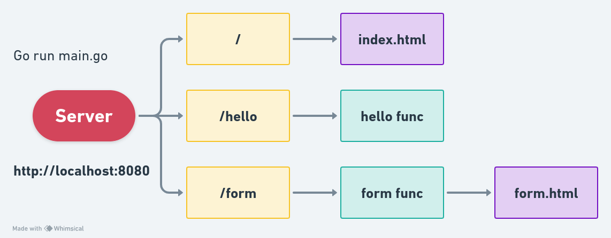

# Simple Web Server using Go

This repository contains a basic GoLang implementation for a simple web server. The server serves static files and includes handlers for processing form submissions and responding with a "hello!" message.


## Project Overview Through Diagram




## Usage

1. Initialize the Go module:

```bash
go mod init <module-name>
```

2. Update dependencies:

```bash
go mod tidy
```

3. Run the server:

```bash
go run main.go
```

Access the server at [http://localhost:8080](http://localhost:8080).

## Endpoints

- `/form`: Handler for processing form submissions via POST requests.
- `/hello`: Handler responding with a "hello!" message.

Replace `<module-name>` with the desired name for your Go module. 